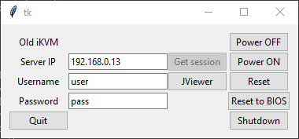

JViewer
=======

Simple jviewer app, supports PowerOFF and iKVM.

Tested on s2400sc.

Example (with params):
`jviewer-starter.py --server 192.168.0.13 --user user --password pass`

Does not require any additional libraries, except installed Java and Python.

NOTE: To correctly use ISO mount, consider using 32-bit for it (use `-j` argument).

For windows, java8 32-bit link coulb be taken from here: [scoop_java](https://github.com/ScoopInstaller/Java/blob/master/bucket/oraclejre8.json)